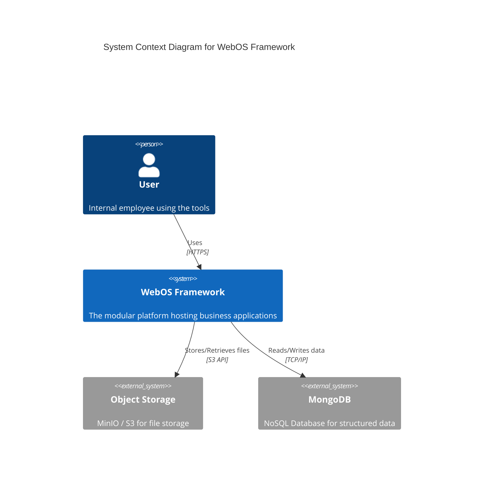
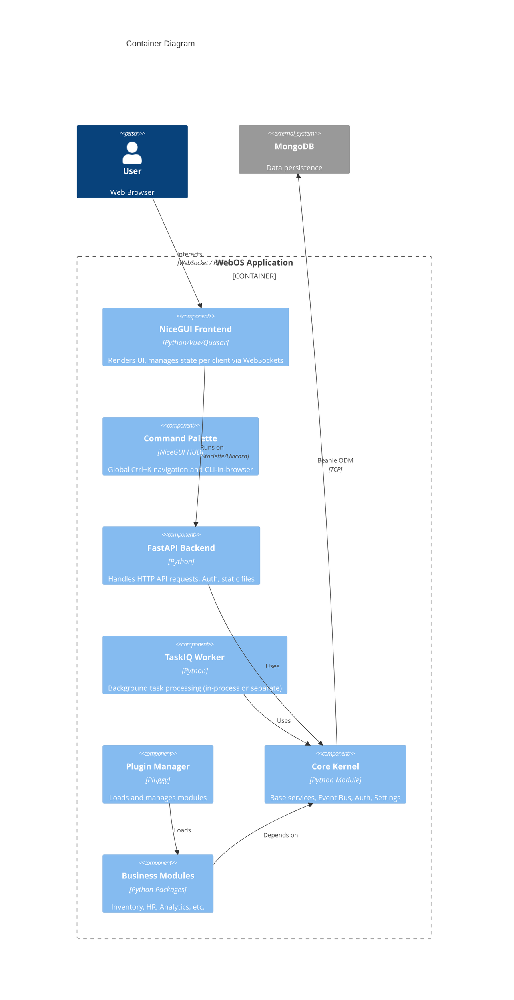
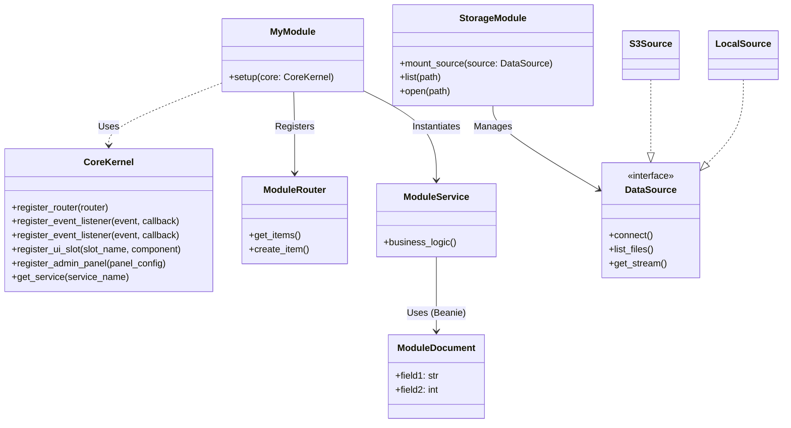

# Architecture Design Document

## 1. System Overview

The WebOS Framework is a **Modular Monolith** architecture. It combines the simplicity of a monolithic deployment with the extensibility of a plugin-based system.

### 1.1. System Context (C4 Level 1)



## 2. Container Architecture (C4 Level 2)

The system runs as a single deployable unit (container/process) but is logically divided.



## 3. Module Architecture

Each module follows a strict structure to ensure isolation and pluggability.



## 4. Key Flows

### 4.1. Request Flow (UI Interaction)
1.  **User Event**: User clicks "Save" on a form in NiceGUI.
2.  **WebSocket Message**: Event sent to server via NiceGUI connection.
3.  **Event Handler**: Python callback in the specific Module triggered.
4.  **Service Call**: Callback invokes `ModuleService.save_entity()`.
5.  **Access Control**: `@require_permission` decorator checks `self.current_user` permissions.
6.  **Database**: `ModuleDocument.save()` writes to MongoDB via Beanie.
7.  **Core Event**: Service emits `entity:saved` event via Core Event Bus.
8.  **Feedback**: `self.messenger.success()` sends toast back to User UI.

### 4.2. Plugin Loading Sequence
1.  **Bootstrap**: `main.py` initializes `CoreKernel`.
2.  **Discovery**: `PluginManager` scans `src/modules` and `entry_points`.
3.  **Registration & Auto-Discovery**:
    *   **Auto-Discovery**: Scans `router.py`, `models.py`, `admin.py` in module dirs.
    *   **Hooks**: Calls `hook.register_routes()` (custom overrides).
    *   **Wiring**: Mounts routers, collects Beanie documents, registers Admin pages.
4.  **Startup**: `Beanie.init_beanie()` called with all collected documents (Auto + Hook).
5.  **Server Start**: Uvicorn starts the app.

## 5. Technical Decisions & Trade-offs

| Component | Choice | Reason | Trade-off |
| :--- | :--- | :--- | :--- |
| **Web Framework** | **FastAPI** | High permornance, async native, auto-docs (Swagger). | Slightly higher learning curve than Flask/Django for beginners. |
| **UI Framework** | **NiceGUI** | Python-only frontend, reactive state, easy push updates. | Server-side state means higher memory usage per concurrent user compared to SPA/API. |
| **Database** | **MongoDB + Beanie** | Schema flexibility, async ODM, ease of cross-linking. | No ACID transactions across collections (though 4.0+ supports multi-doc transactions). |
| **Task Queue** | **TaskIQ** | Broker-agnostic, easy integration with FastAPI/Pydantic. | Less mature ecosystem than Celery, but more modern/async-friendly. |
| **Modularity** | **Pluggy** | Minimalist, used by Pytest, strict interface definitions. | Requires explicit hook definitions, less "magic" than simple introspection. |

## 6. Directory Structure

```text
repo_root/
├── src/
│   ├── core/              # Kernel code
│   │   ├── auth/          # User & Auth logic
│   │   ├── bus/           # Event Bus
│   │   ├── db/            # Base DB models & init
│   │   └── ui/            # Base UI kit & Layouts
│   ├── modules/           # Plugin directory
│   │   ├── admin/         # Core Admin Module
│   │   ├── storage/       # Storage Module (MinIO/S3/Local)
│   │   ├── cache/         # Caching Module (diskcache)
│   │   ├── inventory/     # Example Business Module
│   │   └── ...
│   └── main.py            # Entry point
├── docs/                  # Documentation
├── tests/                 # Pytest suite
└── pyproject.toml         # Dependencies & Tool config
```

## 7. Architectural Patterns
*   **Modular Monolith**: Single deployment, logical separation.
*   **Clean Architecture**: 
    *   **Entities** (Beanie Models) -> **Use Cases** (Services) -> **Interface Adapters** (Routers/UI).
*   **Event-Driven**: Decoupling modules via Event Bus.
*   **Hexagonal (Ports & Adapters)**:
    *   **Ports**: `DataSource` Protocol, `Service` Interfaces.
    *   **Adapters**: `S3DataSource`, `MongoRepository`.
