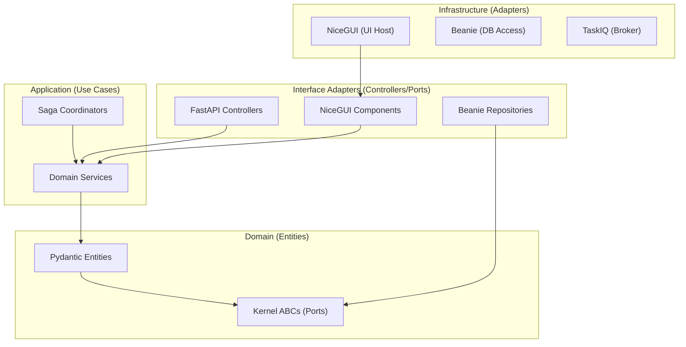

# Web OS Engine Technical Architecture

This document provides a deep dive into the technical implementation of the Web OS Engine, following Clean Architecture and Ports & Adapters principles.

## 1. Layered Architecture

The system is organized into concentric layers. Dependencies only point **inwards**.



## 2. Dependency Injection (DI) Container

The Engine utilizes a registry-based DI pattern to decouple modules from the persistent infrastructure.

### 2.1 The Container
```python
class DIContainer:
    _registry = {}

    def register(self, port: Type[T], adapter: T):
        self._registry[port] = adapter

    def resolve(self, port: Type[T]) -> T:
        return self._registry[port]
```

### 2.2 Constructor Injection
Modules define requested types in their `initialize` or constructor, and the Engine's module loader resolves them automatically.

## 3. Data Flow: Mapping Patterns

To satisfy Clean Architecture, data is mapped at the boundaries:

1.  **Persistence -> Domain**: Repository converts `Beanie Document` -> `Pydantic Entity`.
2.  **Domain -> Presentation**: Service returns `Pydantic Entity`, which the UI Component renders.
3.  **Presentation -> Application**: UI Form validates input into a `Command DTO` (Pydantic), passed to the Service.

## 4. Inter-Module Orchestration

### 4.1 Event Bus (Choreography)
Used for secondary side-effects. The caller emits an event and doesn't wait for a result.
- **Failures**: Handled locally by subscribers or ignored.

### 4.2 Saga Coordinator (Orchestration)
Used for critical business transactions involving multiple modules.
- **State Machine**: The Saga tracks the progress of each step.
- **Compensation**: If Step 2 fails, the Saga explicitly calls the compensation method for Step 1.

## 5. Architectural Guardrails

To prevent "The Monolith" from becoming "The Big Ball of Mud":
- **Import-Linter**: Enforces that `domain` cannot import from `infrastructure`.
- **Namespace Isolation**: Each module has its own `internal/` directory for implementation details, only exposing an `api/` or `interface/` layer.
